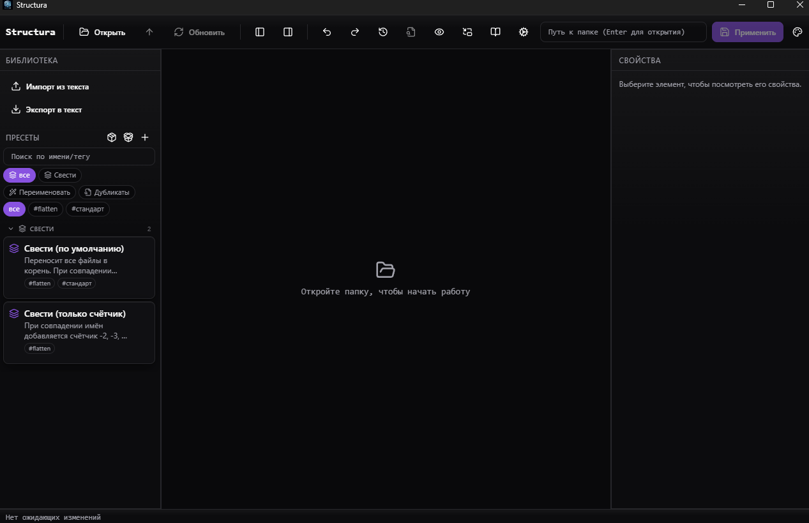

# Structura

[🇷🇺 Русский](./README.md) · [🇬🇧 English](./README.en.md)

Кроссплатформенный инструмент для работы с файловой структурой: сканируй папку, планируй любые операции (переименование, перенос, схлопывание, сведение, массовое создание, пакетное переименование по шаблону) в песочнице с цветным diff «до / после», применяй одной транзакцией.

**Главное правило:** ни одно разрушительное действие не касается диска до тех пор, пока ты не нажмёшь «Применить».

Windows · macOS · Linux. Собрано на Tauri 2 (Rust) + React 18 + TypeScript + Tailwind + Shadcn UI. Интерфейс двуязычный: русский (по умолчанию) / English.



## Возможности

### Ядро (P0)

- **Виртуальное дерево** — сканирование через `jwalk` (параллельный обход, ~10× быстрее обычного рекурсивного walk на больших деревьях).
- **Песочница** — любое действие (переименовать, удалить, перенести, скопировать, схлопнуть, создать) меняет только in-memory-дерево. Диск не трогается до `Ctrl+S`.
- **Diff «до / после»** — подсветка строк цветом: зелёный = новое, красный = удалено, жёлтый = переименовано, синий = перемещено.
- **Сведение (Flatten)** — два режима:
  - *Свести в эту папку* — вытаскивает файлы из всего поддерева в выбранную папку.
  - *Схлопнуть папку* — выносит содержимое на уровень выше и удаляет саму папку.

  Детерминированное разрешение конфликтов (префикс родителя / счётчик / заменять / пропускать / спрашивать), лимит по размеру файла, шаблоны переименования.
- **Копировать / вырезать / вставить** — `Ctrl+C` / `Ctrl+X` / `Ctrl+V` или контекстное меню. Рекурсивная копия папок с сохранением структуры, мультивыбор.
- **JSON / Markdown / tab-indent** — импорт / экспорт дерева в три формата. Загрузка из файла и сохранение в файл — через нативные диалоги ОС.
- **Умный поиск** — glob (`*.log`, `?.tsx`, `[abc]`). Два режима: подсветка или фильтр (скрывает несовпавшие). Кнопка «Выделить всё» для массовых действий.
- **Поиск внутри файлов** — чекбокс в строке поиска включает полнотекстовый скан содержимого (до 10 МБ на файл, двоичные файлы пропускаются, макс. 5 000 попаданий). Совпадения объединяются с поиском по имени.
- **Контекстное меню** — открыть как корень, новый файл / папка, переименовать (inline + по шаблону), копировать / вырезать / вставить, копировать имена / пути выделенных, свести, схлопнуть, копировать путь, показать в проводнике, удалить. Правый клик на одном из выделенных узлов сохраняет мультивыбор — все действия отрабатывают на всём наборе.
- **Авто-уникальные имена** — три новых файла с дефолтным именем становятся `new-file`, `new-file (2)`, `new-file (3)`, а не молча склеиваются на Apply.
- **Drag-and-drop** — тащи любую строку. Drop на файл переносит в родительскую папку.
- **Безопасность** — единственная команда записи (`apply_transaction`), все пути валидируются внутри корня сканирования, soft-delete в `.structura-trash/`, предварительная проверка свободного места.

### Профи-инструменты (P1)

- **Библиотека пресетов** — конфигурации Flatten с тегами, хранятся в SQLite, переживают перезапуск. Экспорт/импорт всех пресетов в JSON для переноса между машинами.
- **История транзакций** — последние 20 применённых транзакций с полным откатом: удалённые файлы возвращаются из `.structura-trash/`, переносы — в обратную сторону, копии/линки — удаляются.
- **Undo / Redo** — неограниченный в песочнице через `zundo`.
- **20 цветовых тем** — Structura Dark / Light, Dracula, Nord, Solarized Dark/Light, Tokyo Night, Catppuccin Mocha, Monokai, GitHub Dark/Light, One Dark/Light, Gruvbox Dark/Light, Rosé Pine / Dawn, Material Ocean, Cobalt2, Ayu Mirage.

### Автоматизация (P2)

- **Поиск дубликатов** — SHA-256 по всем файлам, группировка по размеру и хэшу, сортировка по потенциально освобождаемому месту. Два режима: в корзину или объединить через **hardlink** (0 новых байт на диске, sha256 идентичен, полностью откатываемо).
- **Symlink / hardlink** — новые операции `symlink { from, to }` и `hardlink { from, to }` в транзакциях. На Windows симлинки требуют Developer Mode или админа.
- **Наблюдатели папок (watchers)** — через `notify` крейт. Пер-наблюдатель правила `glob → пресет`: на событиях «создание» файла, соответствующего маске, автоматически применяется пресет к родительской папке. Режимы: только отметить (journal badge) или применить.
- **Пакетное переименование по шаблону** — два режима:
  - на папке (правый клик → «Переименовать по шаблону…») — переименовывает всех детей;
  - на мультивыборе («Переименовать выделенные (N) по шаблону…») — работает на произвольном наборе файлов из разных папок, конфликт проверяется по каждому родителю отдельно.

  Шаблон поддерживает `{file}`, `{name}` (alias для `{base}`), `{base}`, `{ext}`, `{parent}`, `{grandparent}`, `{n}` / `{counter}`, `{n:02}`, `{n:03}`, `{n:04}` (счётчик с ведущими нулями), `{date}`, `{datetime}`, `{year}`, `{month}`, `{day}`, `{hour}`, `{minute}`, а также метаданные `{exif_date}`, `{exif_camera}`, `{exif_lens}`, `{exif_width}`, `{exif_height}`, `{id3_artist}`, `{id3_title}`, `{id3_album}`, `{id3_year}`, `{id3_track}`. 25 готовых пресетов сгруппированы по категориям: общие / с нумерацией / фото / музыка / видео / документы.
- **Метаданные** — автоматическое чтение EXIF (фото) и ID3 (аудио) при фокусе на файле. Отображается в панели «Свойства».
- **Плавающий DnD-виджет** — отдельное 180×180 прозрачное всегда-поверх окно с собственным capability-файлом (разрешения на window dragging + event emit/listen). Перетащи папку — она откроется в Structura как корень.
- **Контекстное меню Windows** — установка через «Настройки»: «Открыть в Structura» в правом клике на папках и пустом месте внутри папки (HKCU registry, без прав администратора).

### Интерфейс и кастомизация (v0.2)

- **Двуязычный интерфейс** — русский (по умолчанию) / English. Переключение в «Настройки → Язык». Словарь в `src/lib/i18n.ts`, больше 250 ключей покрывают весь UI. Новые файлы / папки, создаваемые в английском режиме, именуются `new-file` / `new-folder`.
- **Справка и инструкции** — кнопка с иконкой книги в тулбаре (или `F1`): 5 вкладок — «Быстрый старт», «Возможности», «Горячие клавиши» (живой список привязок), «Шаблоны» (полный справочник переменных), «FAQ».
- **Настраиваемые горячие клавиши** — «Настройки → Горячие клавиши»: клик по полю + нажатие → новая привязка, `Esc` — отменить, `Delete` — сбросить на дефолт, кнопка «Сбросить все». 17 действий. Хранится в `uiStore`, работает через `e.code` — стабильно на любой раскладке.
- **Наглядный диалог Apply** — 6 карточек-метрик (всего / +создать / →переместить / ~переименовать / ×удалить / расчётный объём) работают как фильтры. Переименования и переносы показываются со split-preview «откуда → куда» с выделенным общим префиксом. Счётчики файлов и папок отдельно. Индикатор свободного места со статусом.

## Установка из готового релиза

Самый простой путь — скачать уже собранный инсталлятор со страницы **[Releases](../../releases)** и запустить. Сборка из исходников нужна только разработчикам (см. следующий раздел).

### Windows

1. Со страницы релиза скачайте `Structura_<версия>_x64-setup.exe` (NSIS, легче) или `Structura_<версия>_x64_en-US.msi` (классический MSI).
2. Запустите. Windows SmartScreen может показать «Неизвестный издатель» — нажмите **«Подробнее → Выполнить в любом случае»**. Установщик не подписан EV-сертификатом (это платно, для pet-проекта избыточно), но бинарник собран на GitHub Actions — рядом с артефактом лежит хэш, можно сверить.
3. Для операций с симлинками включите Developer Mode: `Параметры → Конфиденциальность и защита → Для разработчиков → Режим разработчика`. Иначе симлинки требуют запуска от имени администратора.

### macOS

1. Скачайте `Structura_<версия>_universal.dmg` — универсальная сборка для Intel и Apple Silicon.
2. Откройте `.dmg`, перетащите `Structura.app` в `Applications`.
3. Если при первом запуске macOS пишет **«Structura повреждено и не может быть открыто»** — это карантинный флаг Gatekeeper, а не реальное повреждение. Снимите его одной командой в Terminal:

   ```sh
   xattr -cr /Applications/Structura.app
   ```

   Приложение не подписано (Apple Developer ID стоит $99/год), поэтому Gatekeeper блокирует запуск по умолчанию. Команда выше удаляет атрибут карантина, после чего macOS запустит приложение.

### Linux

- **Debian / Ubuntu (`.deb`):**

  ```sh
  sudo dpkg -i structura_<версия>_amd64.deb
  sudo apt -f install   # добавит зависимости, если dpkg пожалуется
  ```

- **Любой дистрибутив (AppImage):**

  ```sh
  chmod +x Structura_<версия>_amd64.AppImage
  ./Structura_<версия>_amd64.AppImage
  ```

  AppImage не требует установки и запускается с любого места.

### Как собираются релизы

Workflow `.github/workflows/release.yml` запускается при каждом push тега вида `v*`. Он поднимает три раннера GitHub Actions (`windows-latest`, `macos-latest`, `ubuntu-22.04`), выполняет `pnpm tauri:build` на каждом и создаёт draft-релиз, куда автоматически загружаются все артефакты: `.msi` + `-setup.exe` (Windows), `.dmg` + `.app.tar.gz` (macOS, universal), `.deb` + `.AppImage` (Linux).

Чтобы выпустить новую версию (для мейнтейнера):

```sh
# 1. Поднимите версию синхронно в трёх файлах:
#    package.json, src-tauri/tauri.conf.json, src-tauri/Cargo.toml

# 2. Закоммитьте и запушьте
git commit -am "chore: bump version to 0.3.0"
git push

# 3. Поставьте тег и запушьте его (именно push тега запускает workflow)
git tag v0.3.0
git push origin v0.3.0
```

После ~15–20 минут в `Actions` будет три зелёных билда, а в `Releases` — draft с артефактами. Допишите changelog и опубликуйте.

### Авто-обновление приложения (`tauri-plugin-updater`)

Structura умеет проверять обновления в GitHub Releases и устанавливать подписанный установщик одним кликом. Чтобы первый релиз собрался корректно, мейнтейнеру нужно один раз сгенерировать ключевую пару и положить её в секреты репозитория.

1. **Сгенерируйте ed25519-пару**:

   ```sh
   pnpm tauri signer generate -w %USERPROFILE%\.tauri\structura-updater.key
   # Linux/macOS:
   # pnpm tauri signer generate -w ~/.tauri/structura-updater.key
   ```

   Команда спросит пароль и создаст:
   - `structura-updater.key` — приватный (НЕ коммитить!)
   - `structura-updater.key.pub` — публичный

2. **Подставьте публичный ключ** в `src-tauri/tauri.conf.json` → `plugins.updater.pubkey` вместо `REPLACE_WITH_TAURI_UPDATER_PUBLIC_KEY` (одна base64-строка из `.pub` файла).

3. **Положите в GitHub Secrets** (`Settings → Secrets and variables → Actions → New repository secret`):
   - `TAURI_SIGNING_PRIVATE_KEY` — содержимое `structura-updater.key`
   - `TAURI_SIGNING_PRIVATE_KEY_PASSWORD` — пароль, который вы задали на шаге 1

4. **Опубликуйте релиз** (draft надо именно *publish*, не оставлять draft — иначе `releases/latest/download/...` отдаёт 404). `tauri-action` сам добавит к артефактам файл `latest.json` с подписями.

Endpoint, который опрашивает приложение, прописан в `tauri.conf.json`:

```
https://github.com/Rimigon/Structura/releases/latest/download/latest.json
```

На стороне приложения проверка обновлений включена по умолчанию (Settings → Updates) и срабатывает не чаще раза в 24 часа. Пользователь может в любой момент отключить автопроверку или нажать «Проверить сейчас».

## Требования и установка с нуля

### Быстрый обзор зависимостей

| Компонент | Версия | Зачем |
|-----------|--------|-------|
| Node.js | 20+ (LTS) | Сборка фронта, Vite, Vitest |
| pnpm | 9+ | Менеджер пакетов |
| Rust | 1.77+ | Tauri-бэкенд и нативные команды |
| Tauri-зависимости ОС | зависит от платформы | См. ниже |

### Windows (с нуля)

1. **Установите Microsoft Visual Studio Build Tools** — нужен линкер MSVC. [Скачать](https://visualstudio.microsoft.com/visual-cpp-build-tools/). При установке выбрать workload *«Desktop development with C++»*.
2. **Установите WebView2 Runtime** — уже встроен в Windows 10 21H2+ и Windows 11. Если нет — [Evergreen installer](https://developer.microsoft.com/en-us/microsoft-edge/webview2/).
3. **Установите Rust** через rustup:

   ```powershell
   winget install Rustlang.Rustup
   # или скачать https://rustup.rs/ и запустить rustup-init.exe
   rustup default stable
   ```

4. **Установите Node.js 20+**:

   ```powershell
   winget install OpenJS.NodeJS.LTS
   ```

5. **Установите pnpm**:

   ```powershell
   npm install -g pnpm
   ```

6. **(опционально для symlink-операций)** Включите Developer Mode: `Settings → Privacy & Security → For developers → Developer Mode`. Без него симлинки на Windows требуют запуска приложения от имени администратора.
7. **Клонируйте и установите**:

   ```powershell
   git clone <repo-url> Structura
   cd Structura
   pnpm install
   pnpm tauri:dev
   ```

### macOS (с нуля)

1. **Установите Xcode Command Line Tools**:

   ```sh
   xcode-select --install
   ```

2. **Homebrew** (если ещё не стоит):

   ```sh
   /bin/bash -c "$(curl -fsSL https://raw.githubusercontent.com/Homebrew/install/HEAD/install.sh)"
   ```

3. **Node.js + pnpm + Rust**:

   ```sh
   brew install node@20 pnpm rustup-init
   rustup-init -y
   source "$HOME/.cargo/env"
   ```

4. **Клонируйте и установите**:

   ```sh
   git clone <repo-url> Structura
   cd Structura
   pnpm install
   pnpm tauri:dev
   ```

### Linux (Ubuntu / Debian с нуля)

1. **Системные библиотеки Tauri** (WebKit, AppIndicator, SVG):

   ```sh
   sudo apt update
   sudo apt install -y \
     libwebkit2gtk-4.1-dev \
     libayatana-appindicator3-dev \
     librsvg2-dev \
     build-essential \
     curl \
     wget \
     file \
     libssl-dev \
     libxdo-dev \
     libgtk-3-dev
   ```

   Для Fedora / RHEL аналоги: `webkit2gtk4.1-devel`, `libappindicator-gtk3-devel`, `librsvg2-devel`, `gtk3-devel`.
2. **Rust**:

   ```sh
   curl --proto '=https' --tlsv1.2 -sSf https://sh.rustup.rs | sh -s -- -y
   source "$HOME/.cargo/env"
   ```

3. **Node.js 20+ и pnpm**:

   ```sh
   curl -fsSL https://deb.nodesource.com/setup_20.x | sudo bash -
   sudo apt install -y nodejs
   sudo npm install -g pnpm
   ```

4. **Клонируйте и установите**:

   ```sh
   git clone <repo-url> Structura
   cd Structura
   pnpm install
   pnpm tauri:dev
   ```

Подробная таблица системных требований — в [Tauri prerequisites](https://tauri.app/start/prerequisites/).

## Скрипты

| Скрипт | Что делает |
|--------|------------|
| `pnpm install` | Скачивает все npm-зависимости |
| `pnpm dev` | Поднимает Vite dev server без Tauri-окна (для отладки в браузере, без ФС) |
| `pnpm tauri:dev` | Vite + Tauri-окно с HMR на обе стороны (TS/React и Rust) |
| `pnpm build` | Typecheck + продакшен-сборка фронта в `dist/` |
| `pnpm tauri:build` | Нативные инсталляторы для текущей ОС в `src-tauri/target/release/bundle/` |
| `pnpm test` | Vitest (TS), одноразовый прогон |
| `pnpm test:watch` | Vitest в watch-режиме |
| `pnpm typecheck` | `tsc --noEmit` |
| `cd src-tauri && cargo check` | Быстрая проверка Rust без запуска |
| `cd src-tauri && cargo test` | Юнит-тесты Rust (fs_ops, safety, команды) |

## Горячие клавиши (по умолчанию)

Всё настраивается в «Настройки → Горячие клавиши». Значения ниже — дефолты.

| Клавиша | Действие |
|---------|----------|
| Ctrl/Cmd + O | Открыть папку |
| Ctrl/Cmd + S | Применить изменения к диску |
| Ctrl/Cmd + Z | Отменить (в песочнице) |
| Ctrl/Cmd + Y или Ctrl+Shift+Z | Повторить |
| Ctrl/Cmd + F | Фокус на поиск по дереву |
| Ctrl/Cmd + C | Копировать выделение в буфер |
| Ctrl/Cmd + X | Вырезать выделение в буфер |
| Ctrl/Cmd + V | Вставить из буфера в выделенную папку |
| Ctrl/Cmd + Shift + C | Копировать имена выделенных (через перевод строки) |
| F1 | Справка и инструкции |
| F2 | Переименовать выделенный узел (inline) |
| F5 | Пересканировать текущий корень |
| Enter | Новый файл внутри выделенной папки |
| Alt + Enter | Новая подпапка внутри выделенной |
| Tab / Shift + Tab | Indent / Outdent выделенного узла |
| Delete | Soft-delete (в корзину на apply) |
| Правая кнопка | Контекстное меню |

Буквенные шорткаты используют физические коды клавиш (`KeyZ`, `KeyS` и т.д.), поэтому работают на любой раскладке, включая кириллицу.

## Архитектура

Три слоя:

1. **Rust-executor** (`src-tauri/`) — тонкий слой безопасных операций: walk, move, mkdir, touch, delete, rename, copy, hardlink, symlink, search-content. Никогда не видит виртуальное дерево, только получает `Vec<Operation>` + `rootFsPath`.
2. **Чистый core** (`src/core/`) — все алгоритмы (tree, parser, flatten, diff, transaction, search). Никакого React/Tauri/DOM, всё тестируется Vitest.
3. **UI** (`src/components/`, `src/stores/`, `src/hooks/`, `src/lib/`) — React + Zustand. Состояние распределено между store-ами (tree / selection / ui / preset / txHistory / watcher). i18n, настройки хоткеев и локаль — в `uiStore`.

Инвариант порядка операций при Apply: `mkdir` (родители первыми) → `touch` → `copy` → `rename` → `move` → `delete` (самые глубокие первыми) → `hardlink/symlink`. Без него Delete может обогнать Move и транзакция падает; hardlink на месте удаляемого файла должен создаваться после soft-delete.

## Статус

v0 (P0 + P1 закрыты полностью):

- Flatten / Dissolve, парсеры (tab / MD / JSON), Import / Export в файл
- Копирование / вырезание / вставка (рекурсивно для папок)
- Drag-drop, умный поиск, мультивыбор, массовое создание
- SQLite-пресеты с тегами, экспорт/импорт пресетов в JSON
- История транзакций + откат, 20 тем, контекстное меню
- Параллельный скан, проверка свободного места, soft-delete

v0.1 (P2):

- Hash-dedup с SHA-256 и hardlink-merge
- Symlink / hardlink как операции транзакции
- Watch-папки с glob-правилами и авто-применением пресетов
- Пакетное переименование по шаблону с EXIF / ID3 переменными
- Чтение метаданных (EXIF / ID3) в свойствах
- Плавающий DnD-виджет (второе окно)
- Интеграция в контекстное меню Windows (HKCU registry)

v0.2 (UI / локализация / качество):

- Двуязычный интерфейс (RU/EN) с runtime-переключением
- Справочный диалог с 5 вкладками (быстрый старт, возможности, хоткеи, шаблоны, FAQ)
- Настраиваемые горячие клавиши + визуальный редактор
- Apply-диалог с карточками-метриками и фильтром по типу операции
- Пакетное переименование: 25 пресетов в 6 категориях, padded-счётчик `{n:02}`/`{n:03}`/`{n:04}`, дата/время, режим мультивыбора
- Полнотекстовый поиск внутри файлов (Rust-команда с binary-sniff)
- Массовое копирование имён и путей, сохранение мультивыбора при правом клике
- Авто-уникализация имён при создании (`new-file`, `new-file (2)`, `new-file (3)`…)
- Починка watcher-диалога (stable empty-array selector) и скролла в пакетном переименовании

## Лицензия

MIT (файл LICENSE будет добавлен).
